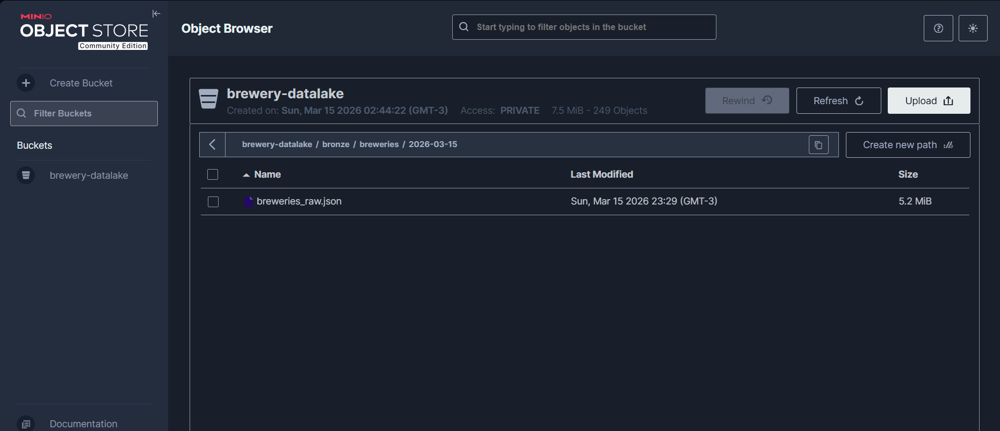
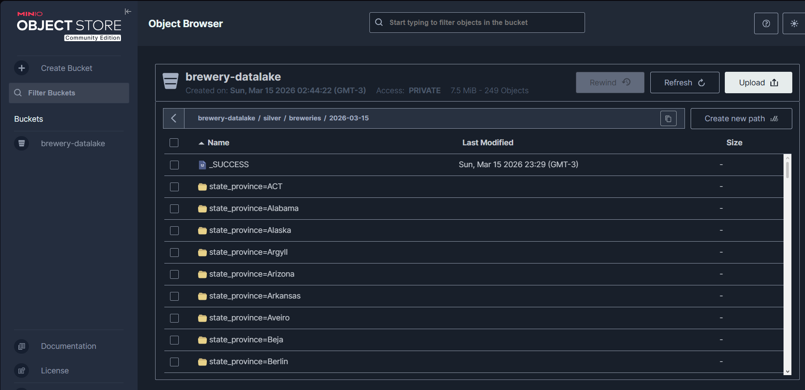
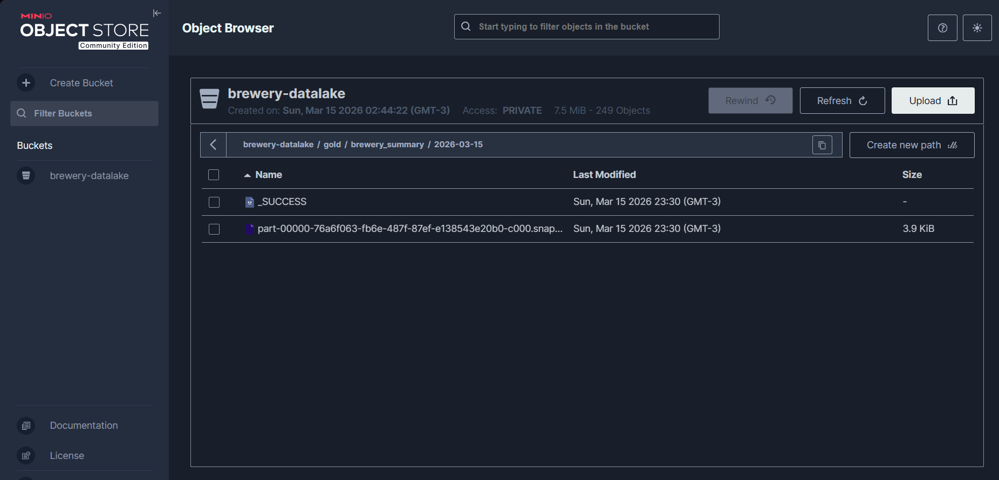
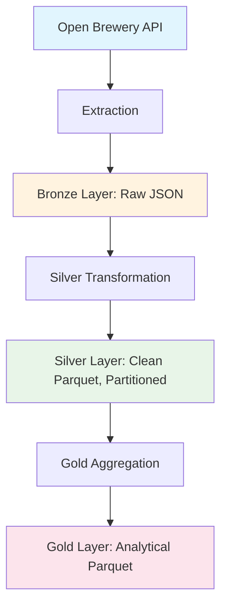
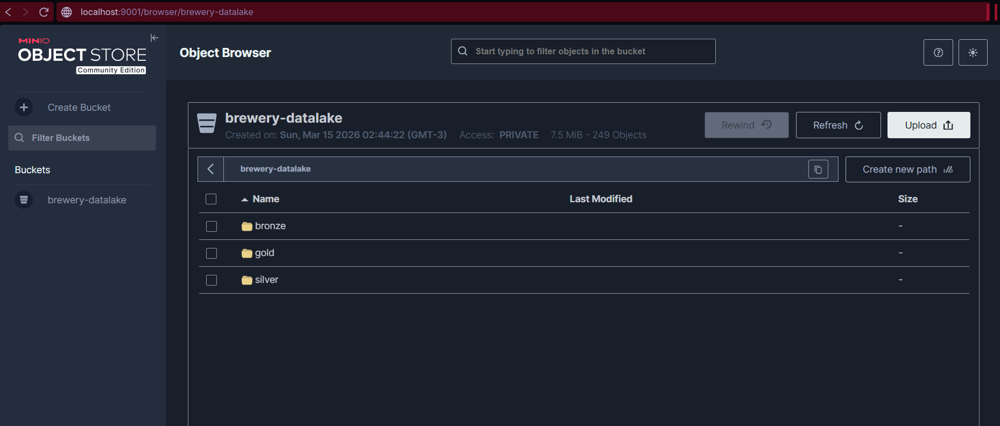
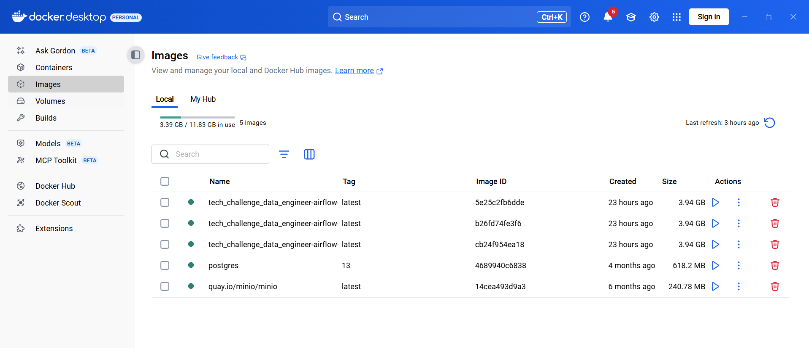
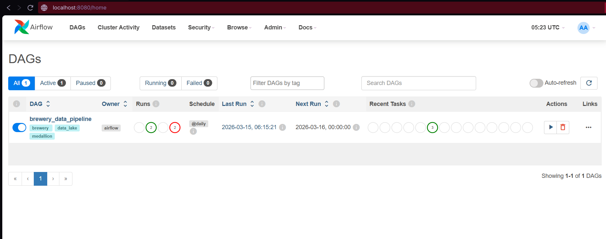
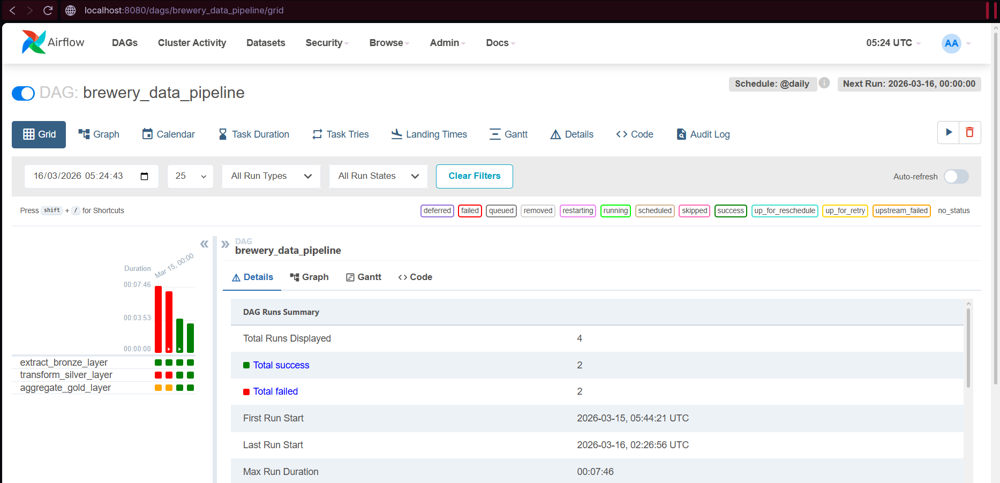

# Brewery Data Pipeline - Medallion Architecture

## Project Overview

This project implements a complete data pipeline to collect, process, and analyze brewery information using the Open Brewery DB API. The goal is to showcase data engineering skills by following the Medallion architecture (Bronze, Silver, Gold), orchestrating tasks with Apache Airflow, processing with PySpark, and storing data in a simulated data lake using MinIO.

The pipeline extracts raw data from the API, transforms it into optimized formats, and generates analytical aggregations in an automated, scalable way.

## Data Lake Architecture (Medallion)

The Medallion architecture splits the data lake into three layers:

### Bronze Layer (Raw Data)
- **Purpose**: Store raw data exactly as received from the source.
- **Format**: API-native JSON.
- **Location**: `s3a://brewery-datalake/bronze/breweries/{date}/breweries_raw.json`

```plaintext
Bronze Layer Diagram:

+---------------------+
|   Open Brewery API  |
+---------------------+
          |
          v
+---------------------+
|   Extraction        |
|   (extract_breweries.py) |
+---------------------+
          |
          v
+---------------------+
|   Bronze Layer      |
|   - Format: JSON    |
|   - Raw data        |
|   - Location: MinIO |
+---------------------+
```



### Silver Layer (Curated Data)
- **Purpose**: Store cleaned, transformed data ready for analysis.
- **Transformations**:
  - Normalize null fields (e.g., use `state` when `state_province` is missing).
  - Remove duplicates by `id`.
  - Convert to columnar Parquet format.
- **Partitioning**: By location (`state_province`).
- **Format**: Parquet.
- **Location**: `s3a://brewery-datalake/silver/breweries/{date}/`

```plaintext
Silver Layer Diagram:

+---------------------+
|   Bronze Layer      |
|   (JSON)            |
+---------------------+
          |
          v
+---------------------+
|   Transformation    |
|   (transform_silver.py) |
|   - Data cleaning   |
|   - Deduplication   |
|   - Partitioning    |
+---------------------+
          |
          v
+---------------------+
|   Silver Layer      |
|   - Format: Parquet |
|   - Partitioned by  |
|     state_province  |
+---------------------+
```



### Gold Layer (Aggregated Data)
- **Purpose**: Store aggregated data optimized for reporting and analysis.
- **Aggregations**: Brewery counts by type and location.
- **Format**: Parquet.
- **Location**: `s3a://brewery-datalake/gold/brewery_summary/{date}/`

```plaintext
Gold Layer Diagram:

+---------------------+
|   Silver Layer      |
|   (Parquet)         |
+---------------------+
          |
          v
+---------------------+
|   Aggregation       |
|   (aggregate_gold.py)|
|   - Count by type   |
|     and location    |
+---------------------+
          |
          v
+---------------------+
|   Gold Layer        |
|   - Format: Parquet |
|   - Aggregated data |
+---------------------+
```







## Technologies Used

- **Orchestration**: Apache Airflow 2.8.1
- **Processing**: PySpark 3.5.0
- **Storage**: MinIO (S3 compatible)
- **Metadata DB**: PostgreSQL (for Airflow metadata)
- **Language**: Python 3.8
- **Containerization**: Docker and Docker Compose
- **Libraries**: requests, minio, pyspark

## Prerequisites

Before running the project, make sure you have:

- **Docker**: Version 20.10 or later.
- **Docker Compose**: Version 2.0 or later.
- **Git**: For cloning the repository.
- **At least 4GB of RAM available** (8GB recommended).
- **At least 5GB of free disk space** for containers and data.

If Docker is not installed, follow the official guides:
- [Install Docker on Windows](https://docs.docker.com/desktop/install/windows-install/)
- [Install Docker on macOS](https://docs.docker.com/desktop/install/mac-install/)
- [Install Docker on Linux](https://docs.docker.com/engine/install/)

## Setup & Configuration

1. **Clone the repository**:
   ```bash
   git clone https://github.com/abnerrbarreto-dataEng/Tech_Challenge_Data_Engineer.git
   cd Tech_Challenge_Data_Engineer
   ```

2. **Verify the files**:
   - Ensure the key files exist: `docker-compose.yaml`, `Dockerfile`, and folders `dags/`, `scripts/`.

3. **Configure environment variables (optional)**:
   - The project uses default settings, but you can update them in `docker-compose.yaml`.

## Running Tests

The repo includes automated tests that validate core data integrity checks (pagination, data transformations, and aggregation outputs). To run the test suite:

```bash
pip install -r requirements.txt
pytest
```

## Running the Pipeline

### 1. Start the Containers

Run the following command from the project root:

```bash
docker-compose up --build
```

This will:
- Build the Airflow image with PySpark and dependencies.
- Start the services: Airflow Webserver, Scheduler, Worker, PostgreSQL, and MinIO.

```plaintext
Example command output:

Creating network...
Building airflow...
Starting postgres...
Starting minio...
Starting airflow-webserver...

Access: http://localhost:8080
```



The first run may take several minutes due to image downloads and build steps.

### 2. Access Airflow

- **URL**: http://localhost:8080
- **User**: airflow
- **Password**: airflow

In the Airflow UI you will find the DAG `brewery_data_pipeline`.

```plaintext
Airflow UI:

- URL: http://localhost:8080
- User: airflow
- Password: airflow

On the main page you will see:
- List of DAGs
- Status: Paused/Running
- Recent runs

For the DAG `brewery_data_pipeline`:
- Click to view details
- Use the "Trigger DAG" button to run
```





### 3. Run the Pipeline

- In the Airflow UI, toggle the DAG to active.
- Click "Trigger DAG" to run it manually, or wait for the daily schedule.

The pipeline runs tasks in sequence: extraction → transformation → aggregation.

### 4. Inspect the Data

Open MinIO at http://localhost:9001 (credentials: minioadmin/minioadmin) to explore the Bronze/Silver/Gold layers.


```plaintext
MinIO UI:

- URL: http://localhost:9001
- User: minioadmin
- Password: minioadmin

Buckets:
- brewery-datalake
  - bronze/
    - breweries/
      - {date}/breweries_raw.json
  - silver/
    - breweries/
      - {date}/ (partitioned)
  - gold/
    - brewery_summary/
      - {date}/ (aggregated)
```

### 5. Stop the Containers

To stop everything:

```bash
docker-compose down
```

To also remove volumes:

```bash
docker-compose down -v
```

## Project Structure

```
brewery-data-pipeline/
├── dags/
│   └── brewery_pipeline.py      # Airflow DAG defining the pipeline
├── scripts/
│   ├── extract_breweries.py     # Extracts API data to Bronze
│   ├── transform_silver.py      # PySpark transformation from Bronze to Silver
│   ├── aggregate_gold.py        # PySpark aggregation from Silver to Gold
│   └── run_pyspark.sh           # Shell wrapper to run PySpark jobs
├── logs/                        # Airflow run logs
├── tests/                       # Automated test suite (pytest)
├── images/                      # Documentation screenshots
├── docker-compose.yaml          # Docker Compose configuration
├── Dockerfile                   # Custom Airflow image build
├── requirements.txt             # Python dependencies
└── README.md                    # This documentation
```

- **dags/**: Contains the Airflow DAG definition.
- **scripts/**: Python and shell scripts that run transformations.
- **logs/**: Stores pipeline execution logs.

## Code Overview and Error Handling

### Main Pipeline (brewery_pipeline.py)

The DAG defines three main tasks:

1. **extract_bronze_layer**: Runs `extract_breweries.py` to pull data from the API.
2. **transform_silver_layer**: Runs `transform_silver.py` using PySpark.
3. **aggregate_gold_layer**: Runs `aggregate_gold.py` using PySpark.

Each task has a retry configuration (1 attempt) and sequential dependencies.

### Data Extraction (extract_breweries.py)

- **Functionality**: Pages through the Open Brewery DB API, collecting all breweries.
- **Error Handling**:
  - Catches HTTP and connection errors and raises them so Airflow marks the task as failed.
  - Validates the JSON response.
  - Validates record integrity (required fields like `id`, `name`, `brewery_type`) before saving.
  - Ensures the MinIO bucket exists before writing.
- **Output**: Saves raw JSON to MinIO.

```plaintext
Extraction Flow:

1. Connect to Open Brewery DB API
2. Page through results (50 per page)
3. Collect all records
4. Save as JSON to MinIO (Bronze)

Error Handling:
- Retry on HTTP failures
- JSON validation
- Detailed logs
```

### Silver Transformation (transform_silver.py)

- **Functionality**: Reads Bronze JSON, applies transformations, and writes partitioned Parquet.
- **Error Handling**:
  - Checks if Bronze data exists.
  - Uses coalesce for null fields.
  - Removes duplicates.
  - Raises exceptions to fail the task if needed.
- **Example**: Data partitioned by state/province.

```plaintext
Silver Transformation:

1. Read Bronze JSON
2. Coalesce null state_province
3. Deduplicate by id
4. Convert to Parquet
5. Partition by state_province
6. Write to MinIO

Transformation examples:
- Null field fallback
- Deduplication
```

### Gold Aggregation (aggregate_gold.py)

- **Functionality**: Aggregates counts by brewery type and location.
- **Error Handling**:
  - Confirms Silver data exists.
  - Groups and counts, sorting results.
  - Writes aggregated results to Parquet.
- **Example**: Count of breweries by type and location.

```plaintext
Gold Aggregation:

1. Read Silver Parquet
2. Group by brewery_type and state_province
3. Count breweries
4. Sort results
5. Write to MinIO

Example output:
brewery_type | state_province | qtd_breweries
micro        | California     | 150
brewpub      | Texas          | 80
```

### General Error Handling

- **Retries**: Airflow retries failed tasks (1 retry by default).
- **Logs**: Scripts print detailed logs for debugging.
- **Exceptions**: Errors are raised so Airflow marks tasks as failed.
- **Validations**: Scripts validate presence of data before processing.

## Monitoring and Alerting

To keep the pipeline healthy and reliable, some monitoring suggestions include tracking execution metrics and failure rates. For data quality, we can monitor whether required fields are present, whether data types are consistent, and whether there are unexpected duplicates.

For pipeline failures, automated alerts can notify the responsible team when a task fails, enabling quick investigation and resolution. This could include email alerts, Slack notifications, or integrations with monitoring tools like Prometheus and Grafana.

Additionally, anomaly detection can be implemented by setting thresholds for key metrics (e.g., minimum record counts per layer) and alerting when those thresholds are not met. Keeping detailed logs and dashboards can also help detect bottlenecks or inconsistencies early.
