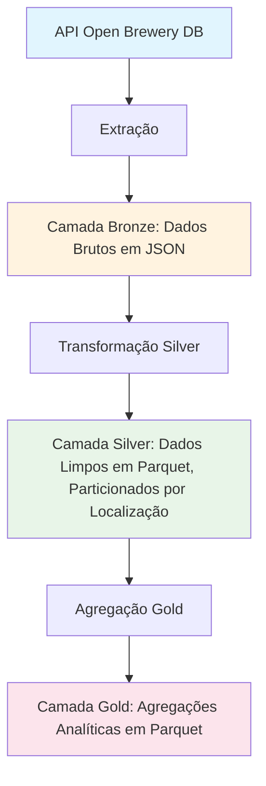

```mermaid
graph TD
    A[API Open Brewery DB] --> B[Extração]
    B --> C[Camada Bronze: Dados Brutos em JSON]
    C --> D[Transformação Silver]
    D --> E[Camada Silver: Dados Limpos em Parquet, Particionados por Localização]
    E --> F[Agregação Gold]
    F --> G[Camada Gold: Agregações Analíticas em Parquet]
    
    style A fill:#e1f5fe
    style C fill:#fff3e0
    style E fill:#e8f5e8
    style G fill:#fce4ec
```